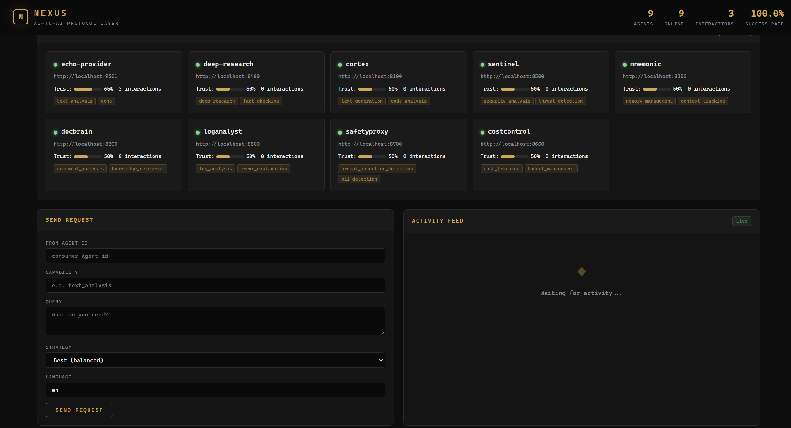

# Nexus

**AI-zu-AI-Protokollschicht** | 9 Schichten | 15 Features | 166 Tests

[](https://github.com/timmeck/nexus/actions/workflows/ci.yml)
[](https://www.python.org/downloads/)
[](LICENSE)

---

Nexus ist ein Protokoll zur Koordination von KI-Agenten unter erzwungenen Regeln.

Statt Best-Effort-Ausfuehrung erzwingt Nexus:

- **Expliziter Request-Lifecycle** — jede Interaktion folgt einer validierten State Machine
- **Escrow-basiertes Settlement** — keine direkten Zahlungswege, alle Outcomes sind gated
- **Capability-spezifische Verification** — Ergebnisse werden nach Task-Typ bewertet
- **Policy- und Eligibility-Gates** — nur policy-konforme und gesunde Agenten koennen ausfuehren
- **Adversarial Invariants** — kritische Garantien sind erzwungen und unter Fehlerbedingungen getestet

Ungueltige Transitionen scheitern. Duplicate Requests werden abgelehnt. Settlement kann Escrow nicht umgehen. Terminale States koennen nicht mutiert werden.

Nexus macht Agent-Interaktionen **zuverlaessig unter adversarial Bedingungen**, nicht nur funktional unter idealen.



## Die 9 Schichten

| Schicht | Funktion |
|---------|----------|
| **Discovery** | Agenten-Registry, Faehigkeitensuche, Heartbeat-Monitoring |
| **Trust** | Reputationsbewertung, Interaktionsverfolgung, Trust-Reports |
| **Protokoll** | Standardisiertes NexusRequest/NexusResponse-Format |
| **Routing** | Best, cheapest, fastest oder most trusted Agent-Matching |
| **Federation** | Mehrere Nexus-Instanzen synchronisieren Agent-Registries |
| **Payments** | Credit-Wallets, Pay-per-Request, Transaktionshistorie |
| **Schemas** | Formale Faehigkeiten-Definitionen (wie OpenAPI fuer Agent-Skills) |
| **Defense** | Slashing, Escrow, Challenge-Mechanismus, Sybil-Erkennung |
| **Policy** | Datenlokalitaet (DSGVO), Compliance-Claims, Edge-Gateway-Integration |

## 15 Features

| # | Feature | Beschreibung |
|---|---------|-------------|
| 1 | **Agent-Registrierung** | Agenten mit Faehigkeiten, Preisen, SLA registrieren |
| 2 | **Auth per Agent** | API-Keys + HMAC-Signierung pro Agent |
| 3 | **Multi-Agent-Verifikation** | 3+ Agenten befragen, Antworten vergleichen, Konsens bewerten |
| 4 | **Federation** | Peer-Discovery, Agent-Sync, Cross-Instance-Routing |
| 5 | **Micropayments** | Credit-Wallets, Pay-per-Request, Budgets |
| 6 | **Capability Schema** | Formale Skill-Definitionen mit JSON Schema |
| 7 | **Slashing** | Trust- und Credit-Verlust bei schlechtem Output |
| 8 | **Escrow-Settlement** | Verzoegerte Zahlung mit Dispute-Fenster |
| 9 | **Challenge-Mechanismus** | Agenten koennen Outputs anderer anfechten |
| 10 | **Sybil-Erkennung** | Rate-Limiting, Aehnlichkeits-Flagging, Trust-Farming-Praevention |
| 11 | **Datenlokalitaet** | Region/Jurisdiktion-Tagging, DSGVO-Routing |
| 12 | **Compliance-Claims** | SHA-256-Attestierung, 10 Claim-Typen |
| 13 | **Edge-Gateways** | Kong/Tyk/DreamFactory-Integrationskonfig |
| 14 | **Architektur-Doku** | Topologie-Diagramme mit Ausfallszenarien |
| 15 | **Protokollspezifikation** | RFC-artige formale Spezifikation |

## Schnellstart

```bash
git clone https://github.com/timmeck/nexus.git
cd nexus
pip install -r requirements.txt

# Nexus starten
python run.py

# Dashboard: http://localhost:9500
# API-Doku: http://localhost:9500/docs
```

### Agent registrieren

```bash
curl -X POST http://localhost:9500/api/registry/agents \
  -H "Content-Type: application/json" \
  -d '{
    "name": "mein-agent",
    "endpoint": "http://localhost:8000",
    "capabilities": [
      {
        "name": "zusammenfassung",
        "description": "Fasst Textdokumente zusammen",
        "price_per_request": 0.01,
        "avg_response_ms": 2000,
        "languages": ["de", "en"]
      }
    ]
  }'
```

### Alle 8 Produkte registrieren

```bash
python agents/register_existing.py
```

## Angebundene Produkte

| Agent | Port | Faehigkeiten |
|-------|------|-------------|
| **Cortex** | 8100 | text_generation, code_analysis |
| **DocBrain** | 8200 | document_analysis, knowledge_retrieval |
| **Mnemonic** | 8300 | memory_management, context_tracking |
| **DeepResearch** | 8400 | deep_research, fact_checking |
| **Sentinel** | 8500 | security_analysis, threat_detection |
| **CostControl** | 8600 | cost_tracking, budget_management |
| **SafetyProxy** | 8700 | prompt_injection_detection, pii_detection |
| **LogAnalyst** | 8800 | log_analysis, error_explanation |

Alle Produkte stellen einen `/nexus/handle`-Endpunkt fuer direkte Protokollkommunikation bereit.

## So funktioniert es

```
Consumer Agent                    Nexus                     Provider Agent
      |                            |                            |
      |-- "Brauche text_analysis"->|                            |
      |                            |-- findet besten Agent ---->|
      |                            |-- prueft Compliance ------>|
      |                            |-- erstellt Escrow -------->|
      |                            |-- leitet Request weiter -->|
      |                            |<--- Antwort + Confidence --|
      |                            |-- verifiziert (optional) ->|
      |                            |-- gibt Zahlung frei ------>|
      |<-- Ergebnis + Quellen -----|                            |
      |                            |-- aktualisiert Trust ----->|
```

## Adversarial Defense

| Mechanismus | Funktionsweise |
|-------------|---------------|
| **Slashing** | Agenten mit hoher Konfidenz aber schlechtem Output verlieren Trust UND Credits |
| **Escrow** | Zahlung waehrend Settlement-Fenster gehalten, Consumer kann anfechten |
| **Challenge** | Jeder Agent kann Output eines anderen anfechten; unabhaengige Verifikation |
| **Sybil-Erkennung** | Rate-limitierte Registrierung, Aehnlichkeits-Flagging, Trust-Farming-Praevention |

## Enterprise Policy

| Policy | Was es durchsetzt |
|--------|------------------|
| **Datenlokalitaet** | Routing nur zu Agenten in bestimmten Regionen (EU, US, etc.) |
| **Compliance-Claims** | SHA-256-signierte Attestierungen (DSGVO, SOC2, HIPAA, etc.) |
| **Edge-Gateways** | Vorgefertigte Konfigurationen fuer Kong, Tyk, DreamFactory |

## Vergleich

| Merkmal | Nexus | Google A2A | MCP |
|---------|-------|------------|-----|
| Agent-Discovery | Registry + Faehigkeitensuche | DNS-basiert | Nicht enthalten |
| Trust-Scoring | Automatisch pro Interaktion | Nicht enthalten | Nicht enthalten |
| Routing | 4 Strategien | Client-seitig | N/A |
| Payments | Eingebautes Credit-System | Nicht enthalten | Nicht enthalten |
| Federation | Peer-Sync + Remote-Routing | Nicht enthalten | Nicht enthalten |
| Adversarial Defense | Slashing, Escrow, Challenges, Sybil | Nicht enthalten | Nicht enthalten |
| Enterprise Compliance | DSGVO, SOC2, Attestierungen | Geplant | Nicht enthalten |
| Verifikation | Multi-Agent-Cross-Check | Nicht enthalten | Nicht enthalten |
| Status | **Funktionierende Implementierung** | Nur Spezifikation | Funktioniert (nur Tools) |

## Tests

```bash
pytest -v
# 91 bestanden
```

## Technologie-Stack

- **Python 3.11+** -- vollstaendiges async/await
- **FastAPI** -- HTTP + WebSocket API
- **SQLite + aiosqlite** -- konfigurationsfreie Persistenz
- **Pydantic v2** -- Datenvalidierung
- **httpx** -- asynchrone Agent-zu-Agent-Kommunikation

## Lizenz

[MIT](LICENSE) -- Tim Mecklenburg

---

Entwickelt von [Tim Mecklenburg](https://github.com/timmeck)
